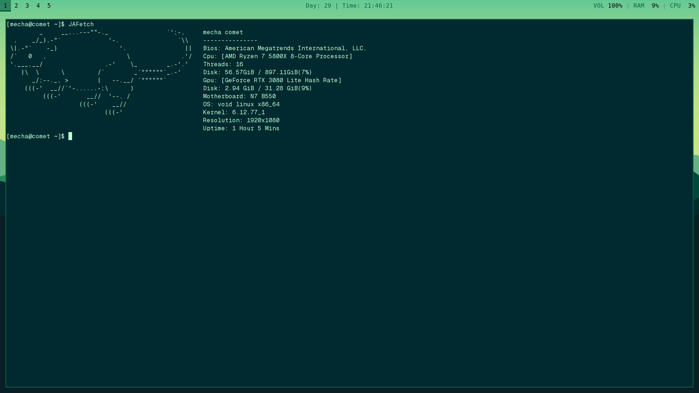

# Just Another Fetch (JAFetch)
This is an application very similar to Neofetch (and later Fastfetch), and was heavily, **heavily** inspired by them so a lot of similarities will be apparent. Just a first project to learn and understand Golang at an actually competent level, it's not the fastest, and not the best, but it does somewhat function only for Linux however.  
 
## INSTALLATION
### Requirements
To check, just run the name of the`~program --help` as long as it doesn't return command not found you should be fine!
- git
- xprop
- uname 

### Install
- `git clone https://github.com/BillTheBall/JAFetch/`
- `cd JAFetch/`                 (If you want to change config do nvim src/config/config.json since it gives best results when changed before moving)
- `sudo mv JAFetch /usr/local/bin/ && sudo mkdir ~/.config/JAFetch && sudo cp -r src/config/config.json ~/.config/JAFetch`

## Supports
- CPU Name 
- Host Name 
- OS Name 
- Memory Usage
- Uptime
- GPU name 
- Seperate Go files for processes
- Disk Drive Usage
- Resolution
- Terminal (ISSUES read extra/issues/TERMINAL.md)
- Init 
- OS Kernel
- BIOS
- Motherboard
- Window Manager
- Config Support
- Images (INFO at extra/config/)
- Network (IP Address)
- Ricing
- Install
 
## Planned Support 
- Multiple GPU support 
- ~~Packages~~ (Scrapped)
- Error Handling ~
- Several OS Support 
- Readable Codebase ~

## WARNING 
**Very early system, terrible error handling, and limited testing contributes to it perhaps being disfunctional, keep in mind when using**

#### Made by Bill The Ball (BTB Studios)
